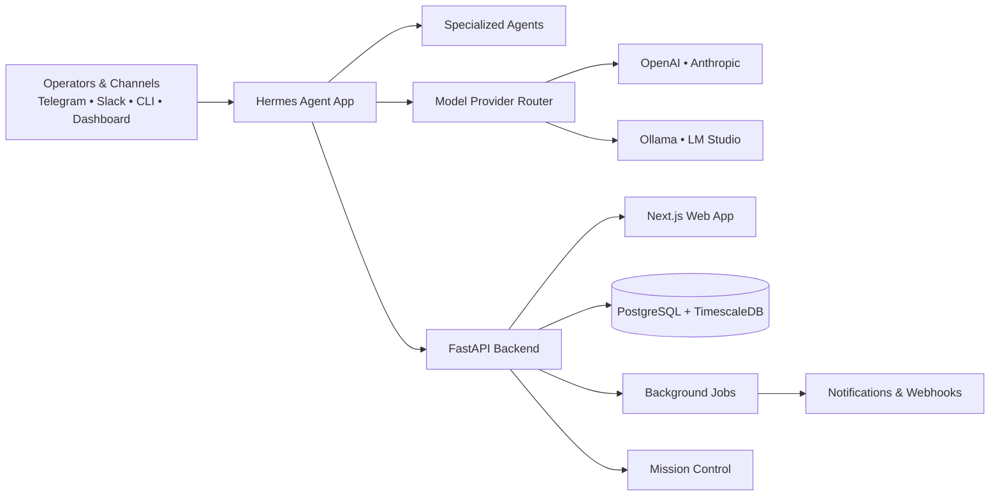
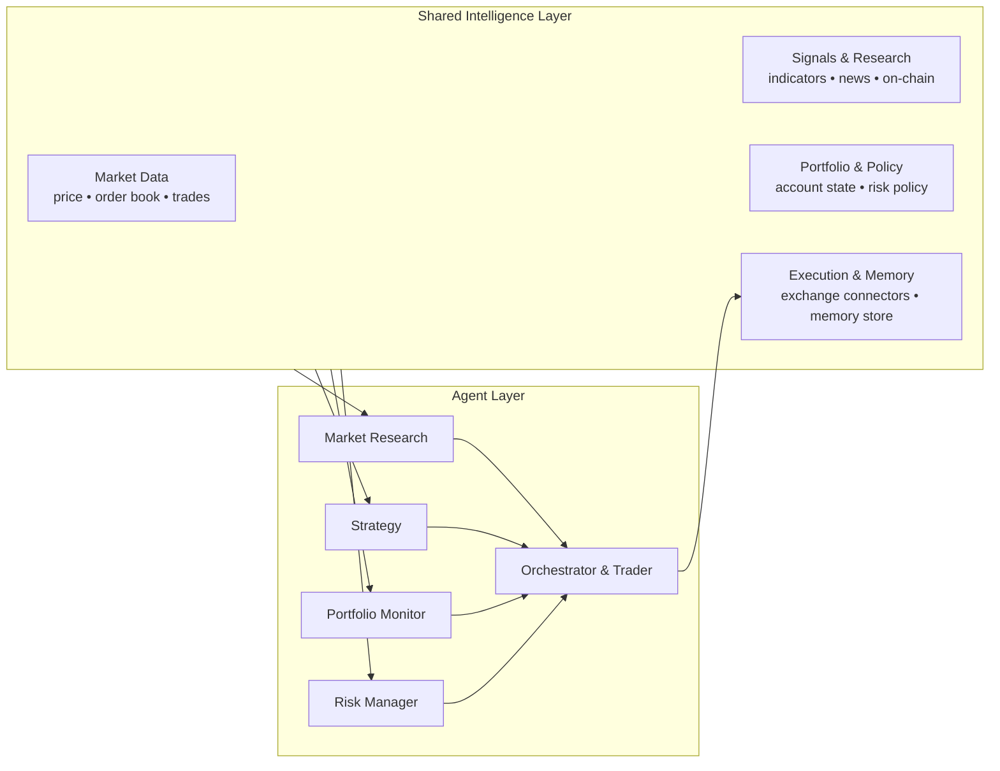
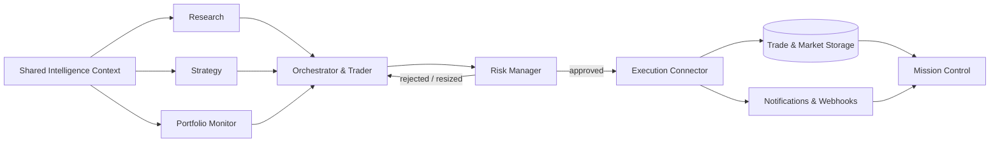
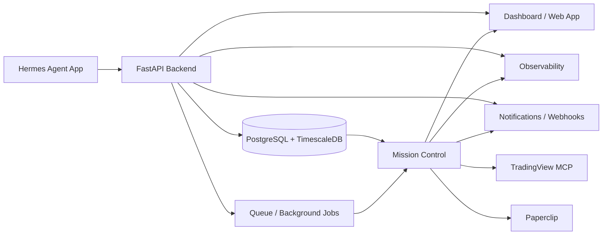
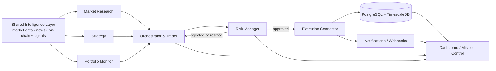
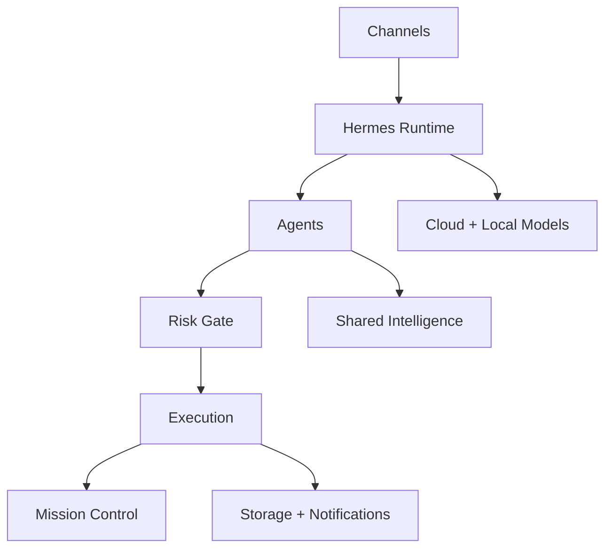
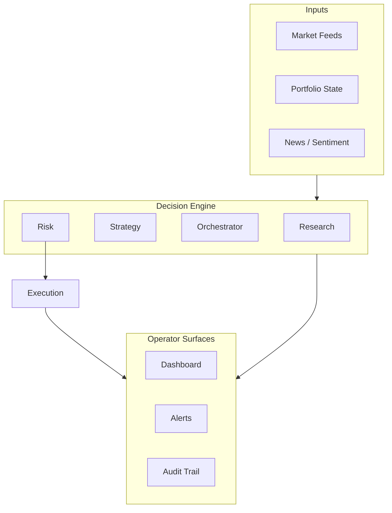

# Hermes Cryptocurrency AI Trader — System Architecture

## 1. Executive Summary

Hermes is a multi-agent cryptocurrency trading platform centered on a single **Agent App** that orchestrates models, tools, market data, execution logic, risk controls, observability, and operator-facing interfaces.

The system is designed around five core ideas:

1. **One central agentic runtime** for reasoning and coordination
2. **Specialized agents** with clear roles and bounded responsibilities
3. **Shared market intelligence infrastructure** that exposes data and actions as reusable tools
4. **Mission Control** for human oversight, analytics, debugging, and intervention
5. **Multi-model flexibility** across cloud APIs and local inference providers

The result is a hybrid architecture where Hermes can reason, research, monitor, propose, validate, and execute trading actions while remaining observable, governable, and deployable across local and API-backed runtimes.

---

## 2. Core Product Vision

Hermes is an **agentic trading operating system** designed to support:

- multi-agent collaboration
- tool-driven market analysis
- strategy generation and evaluation
- portfolio and risk supervision
- operator workflows across chat, dashboard, and automation surfaces
- support for both cloud and local models

Hermes should be able to:

- ingest live market context
- combine technical, macro, sentiment, and portfolio inputs
- decide which agent should act
- escalate decisions through risk gates
- notify operators through external channels
- maintain logs, traces, and state for review

---

## 3. High-Level System Domains

### A. Hermes Agent App
The central application runtime for all agentic workflows.

### B. Agent Layer
A set of specialized agents with distinct responsibilities.

### C. Shared Intelligence Layer
A common layer exposing data, tools, skills, and connectors to all agents.

### D. Mission Control
Human-facing control plane for oversight, dashboards, notifications, and operator intervention.

### E. Model Provider Layer
Cloud and local model backends used depending on latency, cost, privacy, and task type.

### F. Execution & Governance Layer
Trade validation, risk enforcement, policy checks, execution routing, and auditability.

### G. Deployment & Infrastructure Layer
Containerized services, databases, local model runtimes, ingress paths, and operational hosting topology.

---

## 4. Hermes Agent App

The **Hermes Agent App** is the central runtime and orchestration layer of the platform.

### Responsibilities
- route tasks to the correct agent
- manage conversations and channel inputs
- select model providers dynamically
- load tools and shared resources
- maintain state, memory, and context windows
- coordinate multi-step workflows
- trigger notifications and webhooks
- send tasks to execution and risk validation flows

### Supported Model Backends
#### Cloud API Models
- Anthropic API
- OpenAI API

#### Local API Models
- LM Studio
- Ollama

### Supported Interaction Channels
- Telegram
- Slack
- CLI
- web application and dashboard surfaces

### Why this matters
This design makes Hermes channel-agnostic and model-agnostic. The runtime remains stable even as providers, models, or interfaces evolve.

### Current Implemented Application Stack
- **Backend API:** FastAPI
- **Frontend / operator web layer:** Next.js web app
- **Primary runtime pattern:** Docker Compose-based local development and service orchestration
- **Primary language for backend workflows:** Python
- **Primary language for web surface:** TypeScript
- **Primary local model gateways:** Ollama and LM Studio
- **Primary cloud model providers:** OpenAI API and Anthropic API
- **Primary operator channels currently in scope:** Telegram, Slack, CLI, and web/dashboard surfaces

---

## 5. Agent Layer

Hermes uses specialized agents rather than a single generalized decision layer.

### 5.1 Orchestrator & Trader (Default)
This is the default primary decision-making agent.

#### Responsibilities
- receive user or system requests
- decide which agent(s) to invoke
- merge outputs from research, strategy, portfolio, and risk agents
- produce final trade proposals
- trigger approved actions or request human confirmation depending on mode

#### Notes
This functions as the primary coordination and decision layer of the platform.

### 5.2 Market Research Agent
#### Responsibilities
- gather and interpret market context
- summarize price action, volatility, structure, liquidity, volume, sentiment, and catalysts
- compare signals across exchanges, timeframes, and sources
- prepare context packages for other agents

#### Typical outputs
- market briefings
- asset intelligence summaries
- catalyst watchlists
- directional confidence notes

### 5.3 Portfolio Monitor Agent
#### Responsibilities
- monitor current positions, exposures, PnL, allocations, and balance changes
- track drift from intended allocations
- detect concentration risk and liquidity issues
- provide portfolio context to trader and risk manager

### 5.4 Risk Manager Agent
#### Responsibilities
- validate proposed actions against policy
- enforce exposure limits, stop logic, position sizing, and drawdown protection
- reject or throttle unsafe actions
- flag anomalous behavior or conflicts across agents

#### This agent should always have veto power.

### 5.5 Strategy Agent
#### Responsibilities
- define, test, refine, and compare strategies
- turn raw market patterns into executable rules or soft decision frameworks
- maintain strategy templates by regime, asset, volatility condition, or timeframe
- support backtesting and forward-testing workflows

---

## 6. Shared Intelligence Layer

This replaces the earlier “Capacitors” label with a more precise architectural term.

### Responsibilities
- connect to external APIs and services
- normalize market and portfolio data
- expose shared resources as tools, skills, and internal service contracts for agents
- share the same resource primitives across all agents
- reduce duplicated logic across the system

### Concept
External data is not consumed directly by every agent in raw form. Instead, Hermes transforms it into **standardized tools and reusable skills**.

This provides the platform with:
 - consistency
 - easier testing
 - shared schema contracts
 - lower integration duplication
 - better governance and observability

---

## 7. Twelve Shared Resources

Below is the confirmed list of the **12 core shared resources** consumed across the Hermes agent ecosystem.

### 1. Market Price Feed
Live and historical OHLCV, ticker, and price-stream data used for directional context, regime analysis, and signal generation.

### 2. Order Book / Depth Feed
Bid/ask depth, spread behavior, imbalance, liquidity pressure, and microstructure signals used for execution timing and conviction refinement.

### 3. Trades / Tape Feed
Recent executed trades, aggressor flow, abnormal prints, sweep behavior, and flow acceleration used to detect real-time participation and momentum shifts.

### 4. Technical Indicator Engine
Computed indicators, multi-timeframe overlays, signal snapshots, volatility bands, momentum states, and trend diagnostics derived from normalized market data.

### 5. Derivatives & Funding Data
Funding rates, open interest, liquidation clusters or zones, basis, and perp/futures positioning signals used to understand leveraged market sentiment.

### 6. Portfolio & Account State
Balances, positions, leverage, margin usage, realized/unrealized PnL, cash availability, and exposure by asset, strategy, or venue.

### 7. Risk Policy Engine
Position limits, loss limits, max drawdown thresholds, exposure caps, kill-switch conditions, approval gates, and policy enforcement rules.

### 8. Strategy Library
Reusable strategy templates, playbooks, hypotheses, regime rules, scenario logic, and decision frameworks available to the Strategy Agent and Orchestrator.

### 9. News / Sentiment / Narrative Feed
Crypto news, macro headlines, social sentiment summaries, event alerts, and narrative extraction used to detect catalysts and contextual shifts.

### 10. On-Chain / Ecosystem Intelligence
Wallet flows, exchange inflows/outflows, protocol activity, token unlock schedules, ecosystem events, and chain-level context relevant to market behavior.

### 11. Execution / Broker / Exchange Connector
Order placement, cancellation, modification, fill status, exchange metadata, account interaction, and execution telemetry across supported venues.

### 12. Memory / Knowledge / Research Store
Persisted research notes, agent memory, prior decisions, trade rationales, post-mortems, learned patterns, and reusable internal knowledge.

### Why these 12 matter
These twelve resources form the shared decision foundation for Hermes. Rather than requiring each agent to integrate raw sources independently, the platform standardizes them into reusable tools, skills, and internal service contracts so that research, trading, risk, strategy, and monitoring operate from a common intelligence base.

---

## 8. Mission Control

Mission Control is the human oversight and operational control center for Hermes.

### Components
- TradingView MCP and ingestion
- Paperclip workflow layer
- web dashboard and management surfaces
- observability stack
- notifications and webhooks
- operator control and review loop

### Responsibilities
- provide operators with visibility into market context, system activity, and decision outputs
- surface active signals, open positions, pending actions, and system health
- inspect traces, logs, and reasoning summaries
- review agent outputs, escalations, and inter-agent conflicts
- support approvals, overrides, pause controls, and emergency intervention
- manage prompts, resources, policies, and routing

### 8.1 TradingView MCP + Ingestion
This functions as a market-context acquisition and tooling bridge.

#### Responsibilities
- chart and market structure access
- external market workspace integration
- signal extraction from TradingView-connected workflows
- ingestion pipeline into agent-usable tools

### 8.2 Paperclip App
Paperclip supports structured workflow design, planning, and product or agent coordination.

#### Responsibilities
- organize tasks, issues, and flows
- define operator workflows
- maintain structured prompts or project management artifacts
- coordinate execution steps across the Hermes project lifecycle

### 8.3 Observability
This layer should capture the critical telemetry already needed by Hermes, while remaining flexible as the stack hardens.

#### Observability domains
- application logs from FastAPI and supporting services
- agent traces and reasoning lifecycle visibility
- model/provider latency across OpenAI, Anthropic, Ollama, and LM Studio paths
- tool invocation metrics and error rates
- execution audit logs
- webhook delivery status
- notification delivery status
- portfolio and risk event timelines
- container and service health visibility
- database and ingestion pipeline health signals

### 8.4 Notifications & Webhooks
Used to distribute key events to external channels and operational endpoints.

#### Example events
- trade proposed
- trade approved
- trade rejected
- stop-loss triggered
- drawdown threshold reached
- provider degraded
- tool failing
- agent conflict detected
- new strategy signal

### 8.5 Dashboard & Management
A visual operator interface for system supervision and operational review.

#### Recommended panels
- system health
- active agents
- model/provider status
- current market state
- open positions
- exposure and risk limits
- recent decisions
- audit trail
- alerts and webhook activity
- strategy performance

### 8.6 Current Mission Control Tooling
Based on the current Hermes implementation path, Mission Control is centered on:

- **TradingView MCP** for market context access and chart-linked ingestion workflows
- **Paperclip** for planning, workflow shaping, and structured operator/project coordination
- **FastAPI service logs** for backend runtime visibility
- **webhooks and channel notifications** for outward event delivery
- **web/dashboard surfaces** for operator review and management
- **container-level service visibility** through the local Docker-based runtime

As the platform matures, this layer can be extended with stronger structured tracing, persistent analytics, dedicated monitoring backends, and richer audit visualizations.

---

## 9. Execution & Governance Layer

This layer is explicitly represented in the architecture because it is one of the platform’s primary control and safeguard mechanisms.

### Responsibilities
- translate approved decisions into executable actions across supported venues
- validate actions against exchange/account constraints
- apply final risk checks before order placement
- record decisions, execution activity, and downstream outcomes
- support dry-run, simulation, paper-trading, and live modes

### Current Execution Stack
- **Execution decision source:** Orchestrator & Trader agent
- **Risk gate:** Risk Manager agent
- **Portfolio context gate:** Portfolio Monitor agent
- **Execution transport:** exchange or broker connectors exposed through shared tools/services
- **Persistence target for market and trade-related time-series data:** PostgreSQL with TimescaleDB extension
- **Application persistence base:** PostgreSQL application database

### Suggested operating modes
- Research Mode
- Advisory Mode
- Paper Trading Mode
- Human Approval Mode
- Semi-Autonomous Mode
- Full Autonomous Mode

### Recommended control flow
1. Research agent builds market context
2. Strategy agent proposes setups
3. Portfolio monitor checks current state
4. Orchestrator composes trade intent
5. Risk manager validates or vetoes
6. Execution connector routes the order
7. Mission Control logs, visualizes, and notifies

### Queueing and Job-Orchestration Note
Hermes already depends on multi-step and scheduled workflows, but the dedicated queue/broker layer should be treated as an infrastructure concern that is either lightweight today or still being formalized. In architecture terms, Hermes should reserve space for:

- scheduled ingestion jobs
- background market refresh jobs
- asynchronous signal evaluation
- deferred notification delivery
- retryable execution and webhook tasks

This keeps the architecture accurate without overstating a queueing stack that may still be evolving.

---

## 10. Deployment & Infrastructure Layer

Hermes is designed to run as a containerized multi-service system with local-first development patterns and support for both API-based and local-model inference paths.

### Current Implemented / Target Runtime Topology
- **Backend service:** FastAPI
- **Frontend service:** Next.js web app
- **Primary database:** PostgreSQL application database
- **Time-series extension:** TimescaleDB extension on PostgreSQL
- **Container orchestration for development and service composition:** Docker Compose
- **Local model runtimes:** Ollama and LM Studio
- **Cloud model providers:** OpenAI API and Anthropic API
- **External interaction surfaces:** Telegram, Slack, CLI, dashboard/web surfaces, notifications, and webhooks
- **Market-context bridge:** TradingView MCP

### Data Infrastructure Notes
- PostgreSQL serves as the application persistence foundation.
- TimescaleDB strengthens the design for time-series market data, signal history, portfolio snapshots, and execution-event retention.
- The architecture should keep historical bars, signal emissions, risk events, and execution timelines queryable in a way that supports both operator review and future strategy evaluation.

### Infrastructure Principles
- local-first development with containerized reproducibility
- ability to switch between local and cloud inference providers with minimal architectural disruption
- separation of agent reasoning, execution controls, and persistence
- durable storage for market and trading timelines
- explicit support for background processing, even if the queue implementation continues to evolve

---

## 11. Suggested End-to-End Workflow

### Workflow A — Standard Trade Decision Flow
1. Market data enters through the Shared Intelligence Layer
2. Research agent analyzes conditions
3. Strategy agent identifies possible setup
4. Portfolio monitor checks current exposure
5. Orchestrator/trader produces a proposed action
6. Risk manager validates or rejects
7. Execution connector places, modifies, or cancels order
8. Observability stack logs the full chain
9. Notifications/webhooks alert operator channels
10. Dashboard reflects live state and decision history

### Workflow B — Human-in-the-Loop Review Flow
1. Agents prepare recommendation
2. Hermes sends proposal to Telegram, Slack, or dashboard
3. Human operator reviews rationale, sizing, and risk
4. Approval or rejection is submitted
5. Execution layer acts accordingly
6. Post-trade data returns to memory and analytics

### Workflow C — Continuous Monitoring Flow
1. Portfolio monitor watches balances and positions
2. Risk manager checks exposures continuously
3. Alerts are triggered if thresholds break
4. Orchestrator can pause execution or escalate
5. Mission Control surfaces the incident immediately

---

## 12. Architecture Principles

### 1. Model Agnostic
Providers can be replaced without requiring a redesign of the broader platform architecture.

### 2. Channel Agnostic
Operators can interact through Slack, Telegram, CLI, and future interaction channels.

### 3. Tool First
Agents operate through structured tools and service interfaces rather than prompt-only behavior.

### 4. Shared Data Contracts
All agents consume normalized schemas instead of fragmented integrations.

### 5. Risk Before Execution
No trade should bypass explicit risk validation.

### 6. Human Override Always Available
Operators must retain pause, approval, and kill-switch control.

### 7. Observable by Default
Material system and trading events should be logged, traceable, and reviewable.

### 8. Mode-Based Autonomy
The same system can operate in research-only, advisory, paper-trading, or live-execution modes.

---

## 13. Recommended Missing Components to Explicitly Add

These are the architectural components that should be explicitly represented as the platform matures.

### A. Memory Layer
- agent memory
- conversation memory
- market session memory
- post-trade learning memory

### B. Prompt / Policy Registry
- system prompts by agent
- routing rules
- guardrails
- risk policy definitions

### C. Backtesting / Simulation Layer
- replay historical market conditions
- test strategies safely
- compare agent decisions against outcomes

### D. Task / Queue Layer
- async jobs
- scheduled analysis
- retriable workflows
- background ingestion

### E. Secrets / Config Management
- API keys
- exchange credentials
- provider routing settings
- environment-specific config

### F. Persistence Layer
- trade logs
- decisions
- risk events
- signal snapshots
- research notes
- webhook history

### G. Identity / Access Control
- operator permissions
- environment roles
- approval authority boundaries

---

## 14. Mermaid Diagram Set — Focused Architecture Views

To improve readability, the original large architecture diagram is split into smaller views that each answer one question quickly: what Hermes is, how agents interact with shared intelligence, how trades flow through governance, and how operators observe the platform.

### 14.1 System Context Overview



### 14.2 Agent Decisioning + Shared Intelligence



### 14.3 Execution + Governance Path



### 14.4 Mission Control + Platform Services



---

## 15. Mermaid Diagram — Execution Flow and Presentation Variants

### 15.1 Real Execution Flow



### 15.2 Slide-Friendly Architecture Summary



### 15.3 Dashboard-Friendly Operations View



---

## 16. Suggested Folder / Module Structure

```text
hermes/
  app/
    api/
    channels/
    orchestration/
    routing/
    sessions/
    workers/
  agents/
    orchestrator_trader/
    market_research/
    portfolio_monitor/
    risk_manager/
    strategy/
  models/
    providers/
    local/
    cloud/
  tools/
    market/
    execution/
    portfolio/
    sentiment/
    onchain/
    research/
  resources/
    schemas/
    adapters/
    registries/
  mission_control/
    dashboard/
    notifications/
    webhooks/
    observability/
    admin/
  policies/
    risk/
    governance/
    prompts/
  memory/
  storage/
  infrastructure/
  backtesting/
  observability/
  tests/
```

---

## 17. Final Naming Recommendations

### Project architecture title
**Hermes Cryptocurrency AI Trader — System Architecture**

### Recommended replacement for “Capacitors”
Recommended choice: **Shared Intelligence Layer**

Other strong options:
- Market Intelligence Fabric
- Decision Support Layer
- Tooling & Resource Layer
- Shared Services Layer

### Naming recommendation for “Mission Control”
**Mission Control** remains an appropriate label. It aligns well with the operator-centric control-plane role defined in this architecture.

---

## 18. Stack Summary

### Confirmed stack already reflected in the current Hermes architecture
- FastAPI backend
- Next.js web application
- PostgreSQL application persistence layer
- TimescaleDB extension for time-series workloads
- Docker Compose for local multi-service orchestration
- Ollama and LM Studio for local models
- OpenAI API and Anthropic API for cloud models
- TradingView MCP for market-context ingestion workflows
- Telegram, Slack, CLI, dashboard surfaces, notifications, and webhooks as operator interaction paths

### Architecture note
Where a component is still evolving — particularly dedicated job queues, broker implementations, or full observability backend choices — this document describes the architecture concretely where confirmed and intentionally flexibly where implementation details are still being finalized.

## 19. One-Line Architecture Summary

Hermes is a model-agnostic, multi-agent crypto trading platform in which a central runtime coordinates specialized agents, shared market intelligence, execution controls, and a human-facing Mission Control layer across cloud and local model providers.